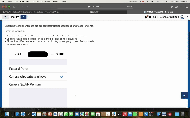

# ToDoList

A simple To-Do List app built with Swift and UIKit to manage your daily tasks efficiently.



## Features

- Add new tasks
- View and manage your tasks
- Persist tasks using `UserDefaults`

## Getting Started

### Prerequisites

- Xcode 12 or later
- iOS 13.0 or later

### Installation

1. Clone the repository:

    ```bash
    git clone https://github.com/your-username/ToDoList.git
    ```

2. Open the project in Xcode:

    ```bash
    cd ToDoList
    open ToDoList.xcodeproj
    ```

3. Build and run the project on the simulator or a real device.

## Usage

- Tap on the **Add** button to create a new task.
- Select a task to view details or edit it.

## Author

Carlos Padilla

## License

This project is licensed under the MIT License - see the [LICENSE](LICENSE) file for details.

